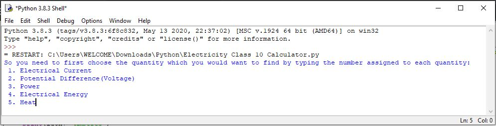

# Electricity-Class-10-Calculator
# 1st Method- Manual Downloading and Setup
This is a application under development which can be used by students of Class 10 to calculate various problems of the section Electricity, By just simply installing it and using it. And before getting into the installation process, I may thank the developers of Python for creating such a good programming language enabling me to do this programme 

# Installation of Python
You can install the Python language if you haven't done it so far from the Python Downloads Page(https://www.python.org/downloads/). You can also take help from various Youtube Videos in the case of Installation. This was the link of the video which helped me install the program:-https://www.youtube.com/watch?v=O5nHFBhCfFo
# How to Start the Program
First of all download the file of Electricity Class 10 Calculator.py file(https://github.com/ayushraj10/Electricity-Class-10-alculator/blob/main/Electricity%20Class%2010%20Calculator.py)
Then please open the python shell as shown below and enjoy the application! and btw this application is under development, so it is not fully working

# Automatic Download and In-browser Use

